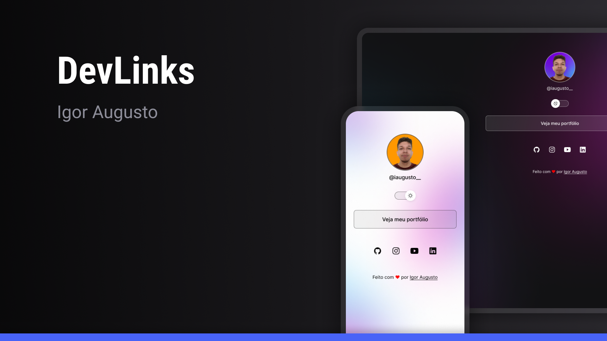

# DevLinks

<div align="center">

</div>

## Descrição

DevLinks: Seu cartão de visitas online personalizado e um agregador de links para profissionais de tecnologia. Crie uma presença online única e centralize seus links, portfólio e informações de contato em um só lugar. Compartilhe facilmente sua presença digital com o mundo e mantenha suas conexões atualizadas com este prático serviço de agendamento de links.

## Status do projeto

Projeto concluído.

## Pré-requisitos

### Tecnologias

- HTML (v5.0 ou superior);
- CSS (v3.0 ou superior);
- JavaScript (ECMAScript 2022);
- Figma.

## Instalando

1. Clone o repositório para o seu ambiente local:

```
$ git clone https://github.com/igoraugustobrz/DevLinks
```

2. Navegue até o diretório do projeto.

```
$ cd DevLinks
```

## Contribuindo

Contribuições são bem-vindas! Se você quiser contribuir para o projeto, siga as etapas abaixo:

1. Fork o repositório e clone-o para o seu ambiente local.

2. Crie uma nova branch:

```
git checkout -b minha-contribuicao
```

3. Faça as alterações desejadas e commit-as:

```
git commit -m "Minha contribuição"
```

4. Envie suas alterações para o repositório remoto:

```
git push origin minha-contribuicao
```

5. Abra uma solicitação de pull no repositório original.

## Autor

- Igor Augusto
- E-mail: igoraugustobz@gmail.com
- Acesse o meu [Portfólio](https://iaugusto.vercel.app/)
- Conecte-se comigo no [LinkedIn](https://www.linkedin.com/in/igorbrz/)
